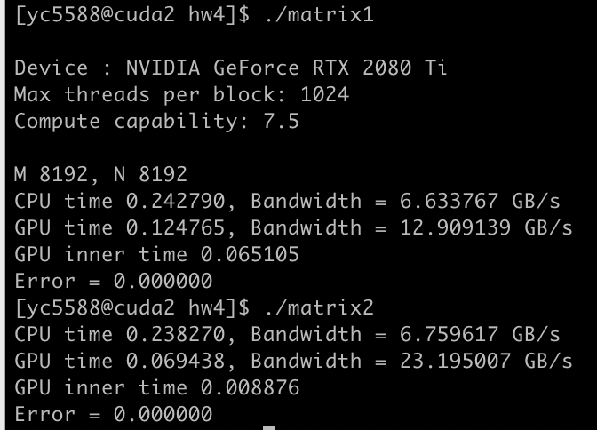
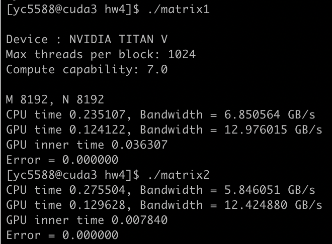
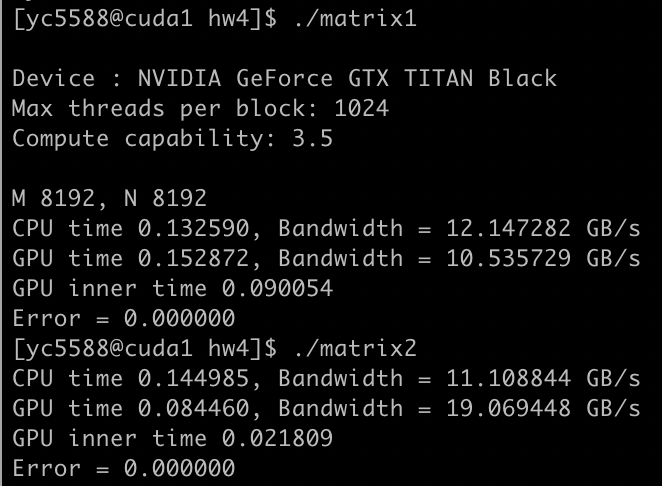
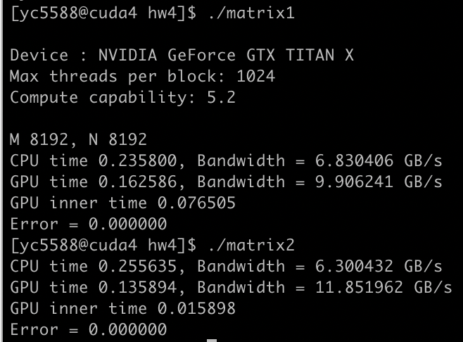
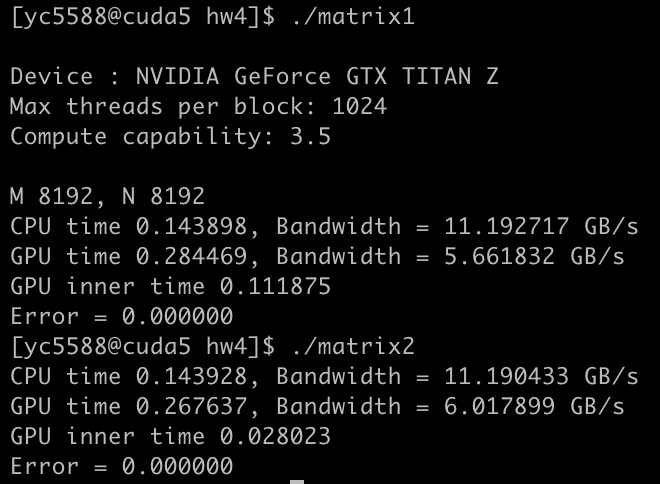
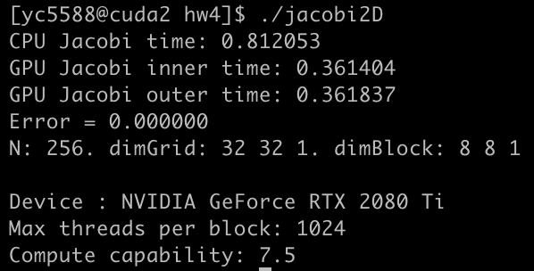
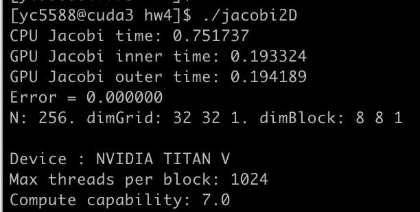
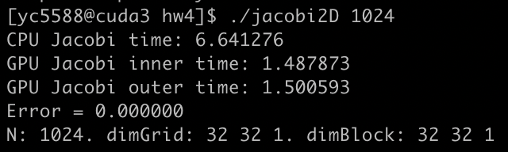

## HPC HW4

> Yuan Chen yc5588

### 1. Matrix-vector operations on a GPU.

Assume for $A\cdot x=z$, where matrix $A$ is $m\times n$ matrix, $x$ is $n\times 1$ vector, output $z$ is $m\times 1$ vector.

I implemented 2 cuda methods for this operation:

1. <u>File `matrix1.cu` .</u>  

   First write a inner product between two long vectors on gpu, then iterate $m$ times to get each `z[i]` for `i = 0 to m-1`. 

   For the inner product, I created a shared array having size `THREADS_PER_BLOCK` in each block, and get the sum of this array for each block by dividing the array to half in each iteration, totally need $\log_2(THREADS)$ itertations. This needs shorter time than serial version.

   This methods involves `atomicAdd` method between type `double` variables in kernel. However, `atomicAdd` method between type `double` variables is **not available** on devices with **compute capability lower than 6.0**, so I added an implemention of `atomicAdd`  for those devices using `atomicCAS`, but this would lower the speed up.

2. <u>File `matrix2.cu` .</u>

   Since the constraint of compute capability for the first method, this is the second method:

   Split $m$ to threads and blocks in GPU, then for each thread with index `i`, compute inner product $A[i,:]\cdot x$ sequentially and write it to `z[i]`.

In the `cuda{1–5}.cims.nyu.edu` compute servers, `cuda2, cuda3` has compute compacacity greater than 6.0, but `cuda1, cuda4, cuda5` has compute compacacity lower than 6.0, so method 1 behaves bad on `cuda1, cuda4, cuda5`. (Default complier flag is `-arch=sm_61`, need to modify makefile and change compiler flag to `-arch=sm_35` for servers with compute compacacity lower than 6.0.)

Test matrix size: $M=2^{14},N=2^{14}$. `THREADS_PER_BLOCK=1024`

Timings: (inner timing is timing without memcpy between device and host)

**`cuda2`**

**`cuda3`** 

**`cuda1`** 

**`cuda4`** 

**`cuda5`** 

### 2. 2D Jacobi method on a GPU. 

File: `jacobi2D.cu` Run command: `./jacobi2D N` where N is the input for matrix dimension, defualt as 256.

Note that to compute the error per iteration as a criteria for convergence, I implementated it within kernel so used `atomicMax`, where `atomicMax` is implented by `atomicCAS` with `double` type as input. So, this should be tested in GPU with compacacity greater than 6.0, i.e. on `cuda2 or cuda3`.

Since the Max threads per block is 1024, I used 2 dimensional threads, each dimension having 32 threads. The correctness is checked by error of `u` and `norm` between serial and cuda version.

Timings:

**`cuda2, N=256`**

**`cuda3, N=256`**

**`cuda3, N=1024`**

### 3. Update on final projection

We have finished the serial code, but have some trouble on simulating the data. Because matrix inverse is involved in calculation, so when data eigenvalues are big, it is unstable, it's easy to get a nan value from the input.
